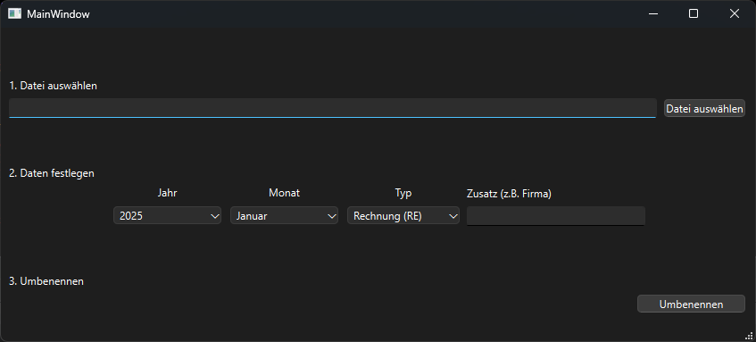

# Rename File Tool

This project contains a small tool to rename a file in a specific format using Qt 6. It was written and tested on Windows but should also be compatible (maybe with minor adjustements) for other plattforms.

The UI is written in german since I developed that tool for my in-laws and my brother-in-law. 

## How to use

After the first start of the program, three txt files are created ('years.txt', 'months.txt', 'type.txt') where the values of the combo boxes for year, month and type are stored. They can be extended manually for additional values (Restart necessary).

## File name creation

The file name is created as follows: $year_$month_$type_$additional_information.

For month the index of the ComboBox is used and a trailing zero is added if the value is smaller then 10. For type, the value in braces '()' is used.